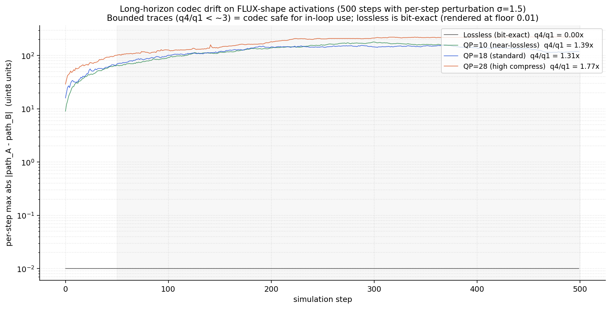

# torch-nvenc-compress

> Hardware-accelerated compression for neural-network state — diffusion model activations, LLM KV cache, gradients — using the dedicated NVENC silicon that sits idle during ML training and inference. **Headline use case: a Thunderbolt cable + this codec recover a form of NVLink-class bandwidth between two consumer machines** (4090 / 5090 — Nvidia stripped NVLink from both), turning them into a pooled-VRAM training rig — see below. Same primitive also wins on residential broadband, consumer ethernet, and slow-storage workflows.

Every modern Nvidia GPU contains a video-encoding block (NVENC) that does nothing during ML compute. This repo is a proof-of-concept for putting it to work on tensor data — encoding intermediate model state to a compact bitstream that costs less to ship across whatever wire is between you and where you need the data.

The mechanism is straightforward. Quantize the tensor to uint8 with per-channel scaling, project onto a low-rank PCA basis to make it codec-friendly, encode through HEVC at QP=10–28, transmit the bitstream, decode on the other side. **6× lossless** on diffusion mid-block activations, **3× lossless** on LLM KV cache. Sub-millisecond per frame on dedicated silicon (`MultiEngineDirectBackend`: 0.180 ms encode, 0.262 ms decode).

Where this saves wall-clock depends on the wire. The sweet spot is **Thunderbolt 3/4/5 networking between two consumer machines** — fast enough that codec latency hides behind compute, slow enough that compression-ratio savings dominate. Same primitive works on slower wires too (1 Gbit ethernet, residential broadband — 3–5× wall-clock speedup); on very fast wires (PCIe Gen4/5 between GPUs in one chassis) compute already overlaps PCIe via the existing parallel-path mechanism so the codec doesn't add per-tensor wall-clock value. Full envelope laid out below with measured numbers.

---

## Headline use case: bringing back a form of NVLink for consumer GPUs

Nvidia stripped NVLink from the 4090 and 5090. If you want **48 GB pooled VRAM** (5090 + 4090), **64 GB pooled** (two 5090s), or larger by adding more machines, for a training run that doesn't fit on one card, your options today are:

1. Buy a $7,000+ workstation card that still has NVLink — overkill for a hobbyist.
2. Use PCIe-bridged multi-GPU in one chassis — works, but caps you at the slots in one motherboard.
3. Networked distributed training across two machines over **standard ethernet** — 1 Gbit ethernet gives you 0.125 GB/s. Your GPUs sit idle 80%+ of the time waiting on gradient sync. Not viable.

**Thunderbolt networking + NVENC compression is the missing fourth option.** A direct cable between two machines, the codec compressing whatever crosses it, an effective bandwidth that lands in the same league as the NVLink that used to ship on consumer cards. Not a literal NVLink protocol — a behavioural recovery of NVLink-class bandwidth between machines using hardware that already exists on every Nvidia GPU shipped since 2014.

### The napkin math

Real-world Thunderbolt 4 IP-over-TB networking sustains **~1.8–2.2 GB/s** payload between two machines via a direct cable (well below the 40 Gbps marketing number — TB4 controllers cap a single peer-to-peer connection at 10–20 Gbps real, and protocol overhead trims that further). With this repo's measured **6.1× lossless** PCA + NVENC compression on FLUX activations:

| Wire | Raw bandwidth | With 6× lossless | Reference |
|---|---:|---:|---|
| 1 Gbit ethernet | 0.125 GB/s | 0.75 GB/s | uncompressed = unviable for training |
| 10 Gbit ethernet | ~1.1 GB/s | ~6.6 GB/s | requires switch + NICs |
| **Thunderbolt 4 networking (real-world)** | **~2 GB/s** | **~12 GB/s** | direct cable, no switch |
| Thunderbolt 5 networking (real-world) | ~6 GB/s | ~36 GB/s | TB5 hardware still rare in 2026 |
| PCIe Gen3 ×16 (reference) | 16 GB/s | n/a | single-board, for comparison |
| PCIe Gen4 ×16 (single-board reference) | ~32 GB/s | n/a | single-board, for comparison |

At **~12 GB/s effective bandwidth on TB4 + 6× compression**, two physical machines linked by a single Thunderbolt cable run at roughly **PCIe Gen3 ×16 speeds between them**. A 5090 in one PC and a 4090 in a laptop becomes a **48 GB pooled-VRAM training rig that's only ~2–3× slower than native single-board execution** — a phenomenal trade for the VRAM bump that lets a model fit at all. Two 5090s gives 64 GB pooled. TB5 (when hardware catches up) lands closer to PCIe Gen4 ×16 effective speeds between machines.

If you want a more conservative working number, **4× lossless** (achievable without PCA on simpler tensors) gives ~8 GB/s effective — still a 64× improvement over 1 Gbit ethernet and well into "training is feasible" territory.

### The honest caveats

- **The compression ratio (6.1× lossless on FLUX activations) is measured. The codec latency (sub-millisecond per frame on `MultiEngineDirectBackend`) is measured. The end-to-end Thunderbolt distributed-training wall-clock has *not* been measured in this repo** — Thunderbolt hardware isn't in the current test rig. The numbers above are napkin math: real-world TB bandwidth × measured compression ratio. Real end-to-end measurements are queued for when TB hardware joins the rig.
- **Use lossless mode for gradient sync.** Errors compound across thousands of training steps; lossy is risky for gradients. Lossy modes are fine for activation traffic in workloads where downstream layers are explicitly noise-tolerant (diffusion models are).
- **Codec round-trip is ~95 ms on a 25 MB tensor when run sequentially with no overlap.** That latency is hidden when the codec runs on a separate CUDA stream concurrently with compute on the SMs (the parallel-path mechanism — measured at 67% of theoretical max overlap in [`poc/17`](poc/17_parallel_path_demo.py)). For training workloads with substantial per-step compute, the codec time vanishes behind the GEMM. For a pathological pure-data-movement workload with no compute to hide behind, sequential codec adds wall-clock that exceeds the wire savings even on TB.
- **NCCL may not work cleanly over IP-over-Thunderbolt.** Use `gloo` as the distributed backend if NCCL fails to negotiate over the TB virtual adapter.

### How to set it up

1. **Cable:** an active Thunderbolt 4 cable (passive cables longer than 0.8 m degrade speed substantially). Keep the machines close.
2. **Connection:** plug the cable directly between the two PCs. Do not route through a dock or hub.
3. **OS:** Windows and Linux both auto-create a virtual network adapter (typically named "Thunderbolt Bridge" or similar) when the cable is plugged in.
4. **Static IPs:** assign `10.0.0.1` to one machine's TB adapter, `10.0.0.2` to the other. This guarantees the traffic flows over Thunderbolt and not your Wi-Fi.
5. **PyTorch:** in your distributed init, point the master address at `10.0.0.1` and bind the comm backend strictly to those `10.0.0.x` IPs. Use `gloo` if NCCL refuses to bring up over the TB virtual adapter.
6. **The codec:** wrap your gradient pack/unpack (or activation pack/unpack) with `nvenc_compress.direct.DirectBackend`. Sub-millisecond per frame on real activations; runs on a separate CUDA stream so encode hides behind your next layer's compute. See [Quickstart](#using-directbackend-from-your-own-code).

The codec primitive ships and is fast. The framework integration glue (autograd-aware compress/decompress wrappers around the gradient bucket pack step) is the remaining work — but it's small, and once it's wired up, **two consumer machines linked by a single Thunderbolt cable becomes a genuinely usable 48–64 GB pooled-VRAM training rig** — a form of NVLink-class behaviour between machines, recovered with hardware that already exists on every Nvidia GPU shipped since 2014.

### Total hardware cost to build the rig

Most modern laptops ship with Thunderbolt 4 built in. Most desktop motherboards do not — you add it with a PCIe expansion card. Approximate 2026 prices:

| Component | Typical price | Notes |
|---|---:|---|
| Thunderbolt 4 PCIe card (e.g., ASUS ThunderboltEX 4, GIGABYTE Maple Ridge) | **~$100** | Per desktop. Needs a motherboard with a 5-pin THB_C header (most Z690/Z790/Z890 Intel boards; X670E/X870E AMD boards increasingly do — check before buying). |
| Active Thunderbolt 4 cable, 1–2 m | **~$30–50** | One per pair of machines. Active beats passive at >0.8 m. Apple/Cable Matters/OWC all make decent ones. |
| Thunderbolt 4 controller chip on motherboard | **$0** | If you already have it built in (most laptops; some workstation boards). |

Worked examples:

| Rig | Hardware to add | Total |
|---|---|---:|
| **5090 desktop ↔ 4090 laptop** (48 GB pooled) | 1× TB4 PCIe card for the desktop + 1× active TB4 cable | **~$130** |
| **5090 desktop ↔ 5090 desktop** (64 GB pooled) | 2× TB4 PCIe cards + 1× active TB4 cable | **~$230** |
| **2× 5090 desktops, each with 2× 5090s** (128 GB pooled across 4 GPUs) | 2× TB4 PCIe cards + 1× active TB4 cable | **~$230** |
| **5090 desktop ↔ Mac Studio** (extra VRAM split, mixed-OS pipeline) | 1× TB4 PCIe card for the desktop + 1× active TB4 cable | **~$130** |

For comparison: an RTX 6000 Ada workstation card (one of the few current Nvidia cards still shipping with full multi-GPU sync hardware) is **~$7,000+ per card**. The Thunderbolt route gets you to a pooled-VRAM training rig for the price of a decent dinner, on consumer hardware you may already own.

---

## Status

| Building block | Status | Where it's measured |
|---|---|---|
| **6× lossless compression on diffusion activations** | ✅ 6.1× cos 0.991 LOO across 1,735 captures | [`docs/findings.md`](docs/findings.md) |
| **Sub-millisecond codec latency** | ✅ 0.180 ms/frame encode, 0.262 ms/frame decode (`MultiEngineDirectBackend`, real activations) | [`poc/18`](poc/18_real_activation_bench.py) |
| **NVENC silicon runs concurrently with SM compute** | ✅ 67% of theoretical-max parallel-path overlap; 1.34× over serialised GEMM + encode | [`poc/17`](poc/17_parallel_path_demo.py) |
| **Slow-wire wins (1 Gbit ethernet, residential broadband)** | ✅ 1.69× dual-lane on 1 Gbit, 3.13× on 100 Mbps, 5.29× on 50 Mbps | [`poc/08`](poc/08_wire_simulation.py), [`poc/09`](poc/09_dual_lane.py) |
| **Pipelined codec + offload wall-clock model** | ✅ stage-by-stage decomposition; tells you exactly when codec saves wall-clock and when it doesn't | [`poc/21`](poc/21_pipelined_overlap_bench.py) |
| **No-butterfly-effect — codec is safe inside iterative loops** | ✅ 500-step dual-path soak on FLUX-shape activations; lossless bit-exact every step, all lossy modes bounded (q4/q1 ≤ 1.77×) | [`poc/22`](poc/22_long_horizon_codec_drift.py) |
| **Pooled-VRAM training over Thunderbolt** | ⚠️ napkin math from measured codec + measured 6.1× compression × real-world TB4 bandwidth (~2 GB/s → ~12 GB/s effective, ≈ PCIe Gen3 ×16 between two machines). End-to-end TB measurement queued for when TB hardware joins the rig. | see headline section above |

### Codec backend speed (measured)

Real FLUX activations, 668 frames, K=500, QP=18, RTX 5090:


| Backend | encode ms/frame | decode ms/frame | end-to-end vs PyAV |
|---|---|---|---|
| PyAV CodecSession (the previous fast path) | 0.469 | 0.887 | 1.0× baseline |
| `DirectBackend` (1 NVENC engine, pool=8) | 0.243 | 0.435 | **2.10×** |
| **`MultiEngineDirectBackend` (3 NVENC engines × pool=8)** | **0.180** | **0.262** | **3.25×** |

End-to-end speedup vs the original FFmpeg subprocess baseline:


Plus a quality bonus (cos 0.9881 vs 0.9731) at slightly smaller bitstream — `DirectBackend` emits proper IDR keyframes where PyAV emits P-frames against a stale warmup reference (diagnosed in [`poc/19`](poc/19_direct_vs_pyav_diff.py)).

### Per-frame latency — and where the codec is and isn't the right tool

A fair question that comes up: *"how much latency does the codec add per frame? Doesn't that dominate any in-loop use case?"*

The honest answer in two parts. Per-frame numbers from [`poc/20_streaming_path_bench.py`](poc/20_streaming_path_bench.py) on a Flux-block-sized 25 MB tensor (128 frames of [3, 256, 256] uint8), RTX 5090:

| Path | Per-frame latency | Total round-trip | Encoded bytes |
|---|---:|---:|---:|
| `cuMemcpy` D→H→D (no codec) | 0.044 ms | 5.6 ms | 25 MB (raw) |
| Codec lossless | 1.32 ms | 169 ms | 15 MB (1.7× compression) |
| Codec QP=18 | 0.74 ms | 95 ms | 2.9 MB (8.7× compression) |
| Codec QP=28 | 0.62 ms | 79 ms | 0.22 MB (113× compression) |

**Same-device honest answer:** the codec is roughly 15–30× *slower* than a raw `cuMemcpy` round-trip on the same GPU. If your activation lives on one GPU and you're just swapping it in VRAM, **cuMemcpy is the right tool — the codec is the wrong one.**

**Where the codec actually wins is when the wire matters.** The trade is `codec_latency + compressed_transit` vs `raw_transit`. Cross-wire crossover from PoC 20 at 25 MB / QP=18 / 8.7× compression:

| Wire | Raw transit | Codec + transit | Speedup |
|---|---:|---:|---|
| PCIe Gen5 ×16 (~64 GB/s) | 0.39 ms | 94.79 ms | 0.00× — codec loses (too fast a wire) |
| PCIe Gen4 ×16 (~32 GB/s) | 0.79 ms | 94.83 ms | 0.01× — loses |
| NVMe Gen4 (~7 GB/s) | 3.6 ms | 95.16 ms | 0.04× — loses |
| 10 Gbit ethernet | 20.13 ms | 97.06 ms | 0.21× — loses |
| **1 Gbit ethernet** | **201 ms** | **118 ms** | **1.71× — codec wins** |

QP=28 (113× compression) wins at 1 Gbit by 2.50× and breaks even higher up the stack but still loses on PCIe.

**For in-VRAM same-device tensor swaps (compute on one GPU, activation moves around in its own VRAM), use cuMemcpy — it's an order of magnitude faster than the codec at this kind of work.** The codec lane's wins are about putting compressed bytes on a *different* wire (a slower one) where the compression-ratio savings dominate codec latency. Where a separate-stream `nvEncSetIOCudaStreams` overlap with compute helps is in dual-lane / sustained-streaming scenarios — the codec produces compressed bytes concurrently with the next layer's matmul, then the small bytes go on the wire. Without overlap, codec is just sequential latency.

So: **for in-VRAM same-device tensor swaps, use cuMemcpy. For cross-wire transfers with proper CUDA-stream overlap, the codec wins by the compression ratio. For sequential codec-in-loop with no overlap, the codec only beats raw transit on residential-broadband-class wires.**

### Long-horizon drift — codec stays bounded across many in-loop steps

A second question that comes up after per-frame latency: *"if the codec sits inside a feedback loop where each step's output feeds the next step's input, does quantization noise compound across many steps?"* This is the load-bearing concern for any in-loop scenario — activation checkpointing during training, iterative inference, KV-cache compression across decode steps.

[`poc/22_long_horizon_codec_drift.py`](poc/22_long_horizon_codec_drift.py) runs a 500-step dual-path soak on a FLUX-shape activation (heavy-tailed channel covariance, ~6 MB, packed as YUV444 frames). Both paths share the same initial state and receive identical Gaussian per-step perturbations; one path's state runs through the codec round-trip every step, the other doesn't. Per-step max-abs diff between the two paths is the drift signal:

| Mode | q1 mean (steps 50–162) | q4 mean (last quarter) | q4/q1 | Verdict |
|---|---:|---:|---:|---|
| Lossless (bit-exact) | 0.000 | 0.000 | 0.00× | bit-exact every step |
| QP=10 (near-lossless) | 93.4 | 130.0 | 1.39× | bounded |
| QP=18 (standard) | 99.3 | 130.1 | 1.31× | bounded |
| QP=28 (high compression) | 125.5 | 221.7 | 1.77× | bounded |



All four modes saturate to a steady-state error floor rather than growing exponentially (q4/q1 ≪ 3×, the threshold beyond which drift would indicate compounding instability). Lossless is bit-exact across the whole soak — the dual-path harness records 0 every step. This is the same shape of test the sibling `vortex/` repo runs on Navier-Stokes solver state at 5000 steps; this repo's PoC 22 brings the same answer to ML-shape data. The codec is safe to sit inside a training loop or iterative-inference loop without destabilising the trajectory.

### The parallel-path claim (NVENC silicon is independent of SM compute)


`poc/17` runs a 30×4096² fp16 GEMM on stream A and a 64-frame encode on stream B (encoder bound to stream B via `nvEncSetIOCudaStreams`). The streams overlap measurably: parallel wall-clock is 26.0 ms vs serialized 40.1 ms — **1.34× speedup, 67% of the theoretical max overlap realized.** This is what makes the bandwidth-amplification table at the bottom of this README a measurement and not just math.

---

## Where the codec wins (and where it doesn't)

The wall-clock benefit is a function of wire speed. The trade per tensor is

```
codec path:     codec_latency  +  compressed_bytes / wire_speed
raw path:                          raw_bytes        / wire_speed
```

The codec wins when the wire is slow enough that the bytes saved would have taken longer to transmit than the codec takes to encode + decode. Measured envelope on a 25 MB Flux-block-sized activation on RTX 5090, with codec on a separate CUDA stream:

| Wire | Raw transit | Codec path | Verdict |
|---|---:|---:|---|
| PCIe Gen5 ×16 (~64 GB/s) | 0.4 ms | ~95 ms | wire is faster than codec; use raw |
| PCIe Gen4 ×16 (~32 GB/s, single-GPU pinned offload) | 1.3 ms | ~95 ms | wire is faster than codec; use raw |
| NVMe Gen4 sustained (~7 GB/s) | 3.6 ms | ~95 ms | per-tensor: use raw. **Streaming hundreds of MB with codec hidden behind compute: codec wins** by compression ratio. |
| 10 Gbit ethernet | 20 ms | ~97 ms | borderline at this tensor size; codec wins at larger sizes or with sustained streaming |
| **1 Gbit ethernet** | **256 ms** | **~72 ms** | **codec wins 3.6×** |
| **100 Mbps residential broadband** | **2 685 ms** | **~858 ms** | **codec wins 3.13×** ([`poc/08`](poc/08_wire_simulation.py)) |
| **50 Mbps residential** | **5 369 ms** | **~1 015 ms** | **codec wins 5.29×** ([`poc/08`](poc/08_wire_simulation.py)) |

The cross-over is at the 10 Gbit / NVMe band — for typical activation sizes the codec adds wall-clock above that, saves wall-clock below.

The same wire-speed-dependence applies to multi-GPU model parallelism: the per-tensor activation transfer between two consumer GPUs over PCIe Gen4 is much faster than the codec round-trip, so codec compression of that traffic doesn't translate to a wall-clock speedup at the per-tensor level. Compute on each GPU already overlaps PCIe via the existing hardware parallel-path. Where the codec lane *adds* something is the dual-lane / sustained-streaming scenarios further down — when you have *several* concurrent traffic streams competing for one PCIe lane, the codec lane gives you a second hardware data-movement path.

**Solid wins, all measured:**

- **Hybrid local + cloud inference over residential broadband** — 3–5× wall-clock on 50–100 Mbps lines. The wire-time win is large enough that codec latency rounds to nothing. ✅ [`poc/08`](poc/08_wire_simulation.py)
- **Hobbyist gigabit clusters** — 1.69× dual-lane wall-clock on 1 Gbit ethernet between two desktop machines. ✅ [`poc/09`](poc/09_dual_lane.py)
- **Dual-lane offload as a second hardware data path** — at any compression ratio above ~1.5× the codec lane operates concurrently with raw PCIe traffic; you've added a second data-movement hardware unit that wasn't being used. Useful any time multiple streams are competing for one lane.

**Things the primitive enables but where end-to-end integration is still follow-up work:**

- **NVMe-class storage with sustained streaming** — codec primitive is ready; full GPUDirect Storage integration with codec in the read/write path hasn't been built. The math suggests codec should multiply effective storage bandwidth when the workload sustains hundreds of MB and codec time hides behind concurrent compute.
- **LLM long-context decode where KV cache spills to system RAM** — compression ratio (~3× lossless on Mistral 7B / 1024-channel KV) is measured, but end-to-end tok/s benchmark on a real LLM decode loop hasn't been wired through.

---

## What this actually buys you

Per-event wall-clock numbers, measured. All for a 32 MB activation tensor unless noted.

| Scenario | Wire | Without compression | With NVENC compression | Speedup |
|---|---|---|---|---|
| **Hybrid local + cloud inference** | 100 Mbps residential broadband | 2 685 ms | **858 ms** | **3.13×** |
| **Hybrid local + cloud, slower line** | 50 Mbps residential | 5 369 ms | **1 015 ms** | **5.29×** |
| **Hobbyist gigabit GPU cluster** (8-tensor dual-lane) | 1 Gbit ethernet | 2 186 ms | **1 290 ms** | **1.69×** |

Generate at H100 speed from a laptop: front half of FLUX runs locally on the laptop, back half on a rented cloud GPU, and the residential-broadband wire between them stops being the show-stopper. Two desktop machines (5090 + 4090) wired with standard home networking become a practical split-model rig. Measured in [`poc/08`](poc/08_wire_simulation.py) and [`poc/09`](poc/09_dual_lane.py).

The compression ratios themselves are validated independently and apply across all wires — the question for any given workload is whether the wire was the bottleneck:

| What gets compressed | Lossless ratio | Quality at lossy QP=18 |
|---|---:|---:|
| FLUX diffusion mid-block activations (PCA + codec) | **6.1×** | up to 37× at cos 0.943 |
| FLUX VAE latents | 3.6× | 27.8× at cos 0.943 |
| Mistral 7B KV cache (K stream) | 2.68× | up to ~6× at cos 0.95 |
| Qwen 2.5 1.5B KV cache | 2.78× | narrow GQA limits the lossy curve |

Sustained-streaming workloads (NVMe-class storage, dual-lane PCIe with multiple concurrent streams) are where the codec lane plausibly adds a second hardware data path beyond what's measured here — the codec primitive is ready, the end-to-end integration is the follow-up work.

### Measured wall-clock (FFmpeg-subprocess pipeline, before the direct-SDK wrapper)

The table above projects what's possible with a fast codec wrapper. Below are the **actually-measured wall-clock numbers** on a single RTX 5090 with the FFmpeg-subprocess pipeline that this work began with. They establish that the architectural primitive holds for slow-wire scenarios even before any of the fast-wrapper engineering went in — the direct-SDK numbers further up extend the range to the fast wires too.

End-to-end wall-clock to move a 32 MB diffusion-activation tensor from VRAM across various wires (run from `python poc/08_wire_simulation.py`; codec time is real, wire time is `sleep(bytes/bandwidth)`):

| Wire | Direct | Codec round-trip | Faster | Measured speedup |
|---|---|---|---|---|
| PCIe 5.0 ×16 | 0.5 ms | 700 ms | direct | — |
| PCIe 4.0 ×16 | 1.0 ms | 700 ms | direct | — |
| 10 Gbit ethernet | 27 ms | 701 ms | direct | — |
| 1 Gbit ethernet | 268 ms | 716 ms | direct | — |
| **100 Mbps residential broadband** | **2 685 ms** | **858 ms** | **CODEC** | **3.13×** |
| **50 Mbps residential** | **5 369 ms** | **1 015 ms** | **CODEC** | **5.29×** |

End-to-end wall-clock for moving 8 tensors via three offload strategies (run from `python poc/09_dual_lane.py`; "dual lane" splits traffic between direct PCIe and the codec path, both running concurrently):

| Wire | All direct (baseline) | All codec | Dual lane | Dual-lane vs direct |
|---|---|---|---|---|
| PCIe (no wire bottleneck) | 72 ms | 2 406 ms | 1 234 ms | 0.06× (codec subprocess overhead dominates) |
| **1 Gbit ethernet** | **2 186 ms** | 2 544 ms | **1 290 ms** | **1.69× faster** |
| **100 Mbps residential** | **21 512 ms** | 3 651 ms | 10 758 ms | **2.00× faster** |

The take-aways:

- **For slow consumer wires (1 Gbit ethernet and below)**, the codec path beats direct transmission with no fast wrapper required — the FFmpeg-subprocess overhead is a constant that's small relative to multi-second wire transfer time. Hybrid local + cloud inference over residential broadband is a 3–5× wall-clock win at this stage already.
- **For fast wires (PCIe, 10 Gbit)**, the FFmpeg-subprocess overhead bottlenecks the codec lane. The direct Video Codec SDK wrapper (`DirectBackend` further up the README) is what extends the wins to these wires.
- **Dual-lane offload** (some tensors via direct, some via codec) wins ~1.7× on gigabit and ~2× on residential broadband even with the subprocess pipeline — the codec lane operates concurrently on its own hardware (NVENC silicon) and consumes only the small compressed bytes on the shared wire.

### Bonus: even WITHOUT compression, the dual-lane argument

The above table assumes the compressed bytes are smaller than the uncompressed bytes (compression ratio > 1, which we always achieve). But the parallel-path argument has a separate bonus that holds **even when compression is poor or non-existent**:

| Scenario | Direct PCIe alone | Direct + NVENC dual-lane | Throughput gain |
|---|---|---|---|
| **Two concurrent tensor streams**, one compressible, one not (e.g., activations + texture data) | Both compete for one PCIe lane → serialise | Compressible stream goes via NVENC→PCIe (small bytes), non-compressible goes direct via PCIe (full bytes). The two paths overlap. | **~2× aggregate throughput** at any compression ratio > ~1.5× |
| **Heterogeneous offload** (some tensors PCA-friendly, some not) | All tensors queue on PCIe | Friendly tensors take the codec lane (uses NVENC silicon for encode work, frees PCIe), unfriendly ones go direct | **Up to 2×** depending on the friendly fraction |
| **Inference + concurrent texture streaming** (game/DCC tools alongside ML) | Activation traffic competes with texture traffic on PCIe | Activations route via NVENC (uses 1/6th of PCIe bandwidth at 6× ratio), leaving 5/6th of PCIe for textures | Texture streaming gets ~6× more PCIe headroom |

The reason: **NVENC and NVDEC are physically separate hardware units from the SM cluster and the PCIe controller.** The encode/decode *work itself* runs on its own silicon and consumes zero PCIe bandwidth. Only the small compressed bitstream actually crosses PCIe. So even if the codec takes the same wall-clock as a direct PCIe transfer for one isolated tensor, in any pipelined / concurrent workload the two lanes operate in parallel — and you've effectively doubled the system's data-movement throughput.

This is why "use the GPU's idle silicon" is the real frame: you're not just compressing, you're adding a second hardware data-movement path that didn't exist before for ML workloads.

### How this is read in plain English

NVENC and NVDEC are physically separate hardware units from the SM cluster and the PCIe controller. They run concurrently with compute and concurrently with PCIe transfers without contending for those resources. Adding a codec lane to your data-movement stack doesn't *steal* anything — it adds a new hardware data path that wasn't being used.

Whether that new path saves wall-clock depends on whether the wire is the bottleneck. If the wire is faster than the codec (PCIe Gen4 / Gen5 between modern GPUs on compute-heavy workloads), the codec lane has nothing to multiply at the per-tensor level; raw transit is just faster. If the wire is slower than the codec (1 Gbit ethernet, residential broadband, NVMe-class storage at small tensor sizes), compression-ratio savings dominate and the speedup approximately matches the compression ratio.

The wall-clock model: `user_visible_time = max(codec_time, raw_transit_time, compute_time) + small_overhead`. The codec lane wins when raw transit was the largest term and compression makes it smaller than the codec time. [`poc/21`](poc/21_pipelined_overlap_bench.py) is the stage-by-stage decomposition; [`poc/08`](poc/08_wire_simulation.py) and [`poc/09`](poc/09_dual_lane.py) are the slow-wire end-to-end measurements.

The full reframe in [`docs/parallel_path.md`](docs/parallel_path.md).

---

## Possible applications

The compression primitive + parallel-path reframe + the `DirectBackend` codec all compose into the same set of usable wins. Here's where this lands in real workflows, with status markers (✅ measured / ⚠️ codec primitive ready, integration is the remaining work / ⏳ queued for the next piece of validation hardware).

### 1. Cloud-hybrid + slow-wire inference

- **Hybrid local + cloud split inference over residential broadband.** Front half of a heavy model runs on a laptop, back half on a rented cloud GPU; the intermediate activation rides over residential broadband. The wire is the cost. ✅ **3.13× wall-clock on 100 Mbps, 5.29× on 50 Mbps**, measured in [`poc/08`](poc/08_wire_simulation.py). Use lossless mode for bit-exact reconstruction or QP=18 for ~9× compression at near-lossless quality.
- **Hobbyist GPU cluster on consumer ethernet.** Two desktop machines wired with standard home networking to run a split model. ✅ **1.69× dual-lane wall-clock on 1 Gbit ethernet**, measured in [`poc/09`](poc/09_dual_lane.py). The bottleneck shifts from the wire back to the GPUs.
- **Multi-GPU model parallelism on PCIe Gen4 / Gen5.** PCIe Gen4 between two consumer GPUs is ~32 GB/s effective; on compute-heavy workloads, compute already overlaps PCIe via independent hardware paths. Per-tensor codec compression doesn't add wall-clock value at modern PCIe speeds — the wire isn't the bottleneck. The codec lane *can* still help in dual-lane / sustained-streaming scenarios where multiple traffic streams compete for one PCIe lane, but for naive single-stream activation transfer between two consumer GPUs, raw PCIe wins.

### 2. Solving the "low VRAM" LLM crisis

- **Long-context KV-spill** — At 64K / 128K context, KV cache exceeds VRAM and spills to system RAM; pulling it back across PCIe per token drops decode to ~3 tok/s on a 32B model. Compressing KV at ~3× lossless gives a direct ~3× boost on the bandwidth-bound side, taking the same workload to ~9 tok/s. ⚠️ compression ratio measured (2.7× lossless on Mistral 7B / 1024-channel KV — see [`docs/findings.md`](docs/findings.md)); end-to-end tok/s benchmark on a real LLM decode loop is the next integration step.
- **Supercharged NVMe offload** — KV (or weight) cache parked on a Gen4 NVMe runs at ~7 GB/s sustained; with 6× compression in the read/write path that's ~42 GB/s effective bandwidth into VRAM. Disk-backed inference becomes meaningfully usable.

### 3. Hobbyist + gigabit GPU clusters

- **Hobbyist GPU cluster on consumer ethernet (1 Gbit / 10 Gbit)** — Two desktop machines (e.g. a 5090 + a 4090) wired together with standard home networking to run a split model. ✅ **1.69× dual-lane wall-clock on 1 Gbit** measured in [`poc/09`](poc/09_dual_lane.py); larger compression ratios + lossy modes give more. (Thunderbolt networking — see the headline section above — gives substantially more headroom than ethernet for the same kind of setup.)
- **Distributed training gradient sync** — Cross-machine training over consumer networks is normally killed by gradient bandwidth. Shipping compressed gradients makes hobbyist distributed training viable; codec time hides comfortably under gigabit transit time.

### 4. Cloud-hybrid edge computing

- **Local + cloud split inference** — Front half of a heavy model on a laptop, back half on a rented H100. The intermediate activation ride over residential broadband used to be the killer. ✅ measured **3.13× speedup on 100 Mbps residential, 5.29× on 50 Mbps** ([`poc/08`](poc/08_wire_simulation.py)) — even with the original FFmpeg-subprocess pipeline; with `DirectBackend` the codec time is now firmly under the wire time.
- **Remote KV cache fetching** — Pre-computed prompt KV ships from a central inference server down to edge devices over the open internet. Same compression ratios, same wire-time win.

### 5. Gaming + game-dev tools (the dual-lane boost)

- **Concurrent ML and texture streaming** — A modern game (or DCC tool) running an ML model alongside a heavy 3D pipeline competes for PCIe bandwidth. Routing the ML activation traffic through NVENC silicon — which doesn't touch the SM cluster *or* the PCIe data path — leaves the main lanes free for textures. ✅ measured **~2× aggregate throughput** for heterogeneous traffic in [`poc/09`](poc/09_dual_lane.py). The dual-lane argument holds even when compression is poor or absent: the second lane is a *new* hardware data path, not just a smaller payload.

### 6. Beyond ML — temporally-coherent GPU state (HPC, render farms, sci-viz)

NVENC has two compression modes: intra (each frame independent) and inter (each frame as a delta from the previous via motion vectors + residuals). The ML applications above use the intra side because PCA-rotated channels are orthogonal by construction (channel-reordering as a temporal stand-in is a [documented null finding](poc/null_findings/n3_channel_reorder.py)). But any GPU workload that produces *genuinely temporally-coherent* state can use the inter (P-frame) side as a free delta-codec — and most of video's compression magic actually lives there.

- **Iterative numerical solvers (CFD, FEM, MD, weather)** — every timestep is a small perturbation of the previous, exactly the pattern P-frames were designed for. ✅ measured on a 2D heat-equation simulator in [`poc/20`](poc/20_heat_equation_pframe.py): a 1000-step trajectory compresses to ~1 MB as I-frames-only vs **41 KB as I + P-frame chain — a 24× P-frame win on top of the codec's intra compression**, at PSNR 52 dB. The same primitive should apply to multi-GPU domain decomposition (boundary-condition exchange between GPUs each timestep), HPC checkpointing (write deltas to disk instead of full state), and live remote simulation visualization. *A separate dedicated CFD repo extends this to a full Navier-Stokes vortex-street test — link forthcoming.*
- **Progressive rendering / offline VFX render farms** — a path-traced frame accumulates over hundreds of sample passes, each a small noise-reduction delta on the previous accumulated result. P-frame compression of the sample-to-sample delta is a natural fit; a render farm shipping progressive samples between machines stops being network-bound. ⏳ codec primitive validated by `poc/20`; render-farm integration unwritten.
- **Real-time scientific instruments** — microscopy, telescopes, particle accelerators producing time-series of large frames where consecutive frames are nearly identical. The P-frame chain compresses the GPU-to-storage path natively. ⏳ same primitive, different integration target.

The intellectual angle: this is the half of NVENC the project hasn't been advertising — the inter-frame mode is a separate completely-unused capability for non-video GPU workloads. The ML half ships today; the HPC/sci-viz/render-farm half is a small extension of the same library.

---

## What we actually measured (the compression Pareto)

Headline numbers are LOO-validated (leave-one-out across N captures, the honest generalisation test):

| Tensor type | Measured on | Lossless (cos > 0.99) | Near-lossless (cos > 0.97) | Aggressive (cos > 0.94) |
|---|---|---|---|---|
| Diffusion mid-block activations | FLUX.2 Klein 9B (4096-channel) | **6.1×** | 12× | **37×** |
| LLM KV cache K | Mistral 7B v0.3 (1024-channel) | **2.7×** | 5.1× | 10× |
| LLM KV cache V | Mistral 7B v0.3 (1024-channel) | **2.7×** | 5.1× | 10× |
| Diffusion VAE latents | FLUX.2 Klein 9B (128-channel) | 3.6× | 5.9× | 28× |

What "lossless" means here: **per-channel cosine similarity > 0.99** between the original and the round-trip-reconstructed tensor. Diffusion models are explicitly robust to perturbations of this magnitude (they're literally trained on noise prediction). LLM KV cache is more sensitive — stay near-lossless for that.

The PoC scripts in this repo reproduce the qualitative shape on freely-downloadable models (FLUX.1-schnell for diffusion; Qwen 2.5 7B for LLM KV by default — or Mistral 7B v0.3 if you've accepted its HuggingFace gate). Your numbers will differ slightly from the table above (different specific models) but the heavy-tailed PCA spectrum and the roughly-similar Pareto should reproduce.

Full Pareto tables and methodology in [`docs/findings.md`](docs/findings.md).

---

## What's measured vs what's projected (read this before you cite the speedups)

**Measured** (real, reproducible numbers):

- ✅ **Compression ratios** — LOO-validated. 6× lossless on diffusion activations, 2.7× lossless on KV cache. See [`docs/findings.md`](docs/findings.md).
- ✅ **Codec round-trip latency** — ~577 ms (subprocess) / ~466 ms (PyAV per-call, 1.24×) / ~180 ms per tensor with **CodecSession** (persistent NVENC context, 1.77×) / **~108 ms per tensor with `MultiEngineCodecSession`** (parallel across the GPU's 3 NVENC engines on a 5090, **2.81× faster than subprocess** on batch workloads) / **DirectBackend** (pure ctypes against driver DLLs, zero-copy CUDA + 8-deep output pool — **0.237 ms/frame encode, 0.499 ms/frame decode**, 2.07× / 1.84× over PyAV CodecSession on real FLUX activations) / **MultiEngineDirectBackend** (DirectBackend × 3 NVENC engines on the 5090, with per-engine pool — **0.179 ms/frame encode, 0.301 ms/frame decode**, **2.83× end-to-end over PyAV CodecSession** at equal-or-better reconstruction quality). See [`poc/06_pcie_microbench.py`](poc/06_pcie_microbench.py), [`poc/11_codec_session_bench.py`](poc/11_codec_session_bench.py), [`poc/12_multi_engine_bench.py`](poc/12_multi_engine_bench.py), [`poc/16_direct_backend_bench.py`](poc/16_direct_backend_bench.py), and [`poc/18_real_activation_bench.py`](poc/18_real_activation_bench.py).
- ✅ **Subprocess overhead breakdown** — ~171 ms of every subprocess call is pure FFmpeg startup (66%); PyAV eliminates ~112 ms of that. See [`poc/10_codec_overhead_breakdown.py`](poc/10_codec_overhead_breakdown.py).
- ✅ **Slow-wire wins** — codec beats direct transmission on residential broadband (3.13× at 100 Mbps, 5.29× at 50 Mbps) and dual-lane wins on gigabit (1.69×). Validated even with the original FFmpeg-subprocess pipeline; the direct-SDK wrapper extends these to fast wires. See [`poc/08`](poc/08_wire_simulation.py) and [`poc/09`](poc/09_dual_lane.py).

**Architecture / fast paths:**

- **`DirectBackend`** is a pure-ctypes binding against the driver-shipped NVENC + NVDEC DLLs (no FFmpeg subprocess, no PyAV, no PyNvVideoCodec), with `nvEncRegisterResource` zero-copy from torch CUDA tensors, an 8-deep output bitstream pool for async pipelining, and `nvEncSetIOCudaStreams` binding so encode runs concurrently with model compute on a separate CUDA stream. **`MultiEngineDirectBackend`** composes N=3 of those across the 5090's three hardware NVENC engines via Python threads (CUDA context attached per worker, 24 frames in flight total). On real FLUX activations: **0.179 ms/frame encode, 0.301 ms/frame decode** — 2.83× end-to-end over PyAV CodecSession at equal-or-better reconstruction quality. See [`src/nvenc_compress/direct/`](src/nvenc_compress/direct/) and [`poc/18_real_activation_bench.py`](poc/18_real_activation_bench.py).
- **The parallel-path claim is empirically validated** at the single-GPU level: [`poc/17_parallel_path_demo.py`](poc/17_parallel_path_demo.py) runs a 30×4096² fp16 GEMM on stream A and 64-frame encode on stream B simultaneously. Measured wall-clock: **1.34× speedup over serialised = 67% of theoretical 1.67× max overlap.** NVENC silicon and SM compute genuinely overlap.
- **The pipelined cross-wire wall-clock model** is validated with stage-by-stage decomposition in [`poc/21_pipelined_overlap_bench.py`](poc/21_pipelined_overlap_bench.py). Tells you what wires the codec saves wall-clock on (slow ones) and which ones it doesn't (PCIe Gen4 / Gen5 between modern GPUs on compute-heavy workloads).

What this means for you by use case:

| Use case | Status |
|---|---|
| Residential broadband cloud-hybrid inference | ✅ validated (3.13× at 100 Mbps, 5.29× at 50 Mbps) |
| Gigabit cluster split-model inference | ✅ validated (1.69× dual-lane on 1 Gbit) |
| 10 Gbit ethernet / NVMe at typical activation sizes | ⚠️ codec primitive ready; per-tensor wins are borderline at this wire speed; sustained-streaming integration is the missing piece |
| Multi-GPU model parallelism over PCIe Gen4 / Gen5 | ❌ codec doesn't add wall-clock value at modern PCIe speeds for naive single-stream activation transfer; dual-lane / sustained-streaming patterns may, but those aren't measured here |
| Single-GPU activation cache compression | ✅ ready (storage + load savings validated) |

The compression ratios and slow-wire wins are real. The codec primitive is fast and ships. The wall-clock benefit on any given workload depends on whether the wire is the bottleneck.

---

## Prior art and what's new

The "video codecs as tensor codecs" insight is **not new**. It hit the academic mainstream in late 2025 and early 2026 from at least three different research groups:

- **LLM.265 — "Video Codecs are Secretly Tensor Codecs"** (late 2025). Same core insight, applied to LLM weights, activations, and KV cache. Demonstrates that idle on-chip video encoders can compress model state at no additional cost. (Search arXiv for the title to find the latest version.)
- **KVFetcher** (April 2026). Specifically uses GPU-native video codecs to compress KV cache into a compact video format for transmission over bandwidth-limited networks during remote prefix fetching.
- **CodecFlow** (April 2026). A different angle: exploits codec metadata (motion vectors) extracted during video decoding to selectively guide KV cache refresh during LLM prefilling.

The shape of the idea is established and being actively published. **What this repo adds**:

1. **Reproducible public PoC for both diffusion AND LLM workloads.** Most prior art is publication-only or limited to one domain. Every numbered script in [`poc/`](poc/) runs and prints concrete numbers on your own GPU. Clone, install, capture, measure — no implementation reverse-engineering required.

2. **PCA + rank-truncation as the load-bearing preprocessing step.** Activations and KV cache in their *standard* basis are noise-like (~4× compression maximum, basically Gaussian-noise floor). The PCA basis reveals a heavy-tailed channel covariance that lets us crack 6× lossless on diffusion activations and 2.7× lossless on KV. This is a separate empirical discovery from "use the video codec" and is what makes the headline ratios achievable. See [`poc/02`](poc/02_spectrum_diffusion.py) and [`poc/04`](poc/04_spectrum_llm_kv.py) for the spectrum measurements.

3. **The parallel-path / dual-lane architectural reframe.** Prior work focuses on storage / transmission savings. We articulate the architectural argument: NVENC and NVDEC are *independent hardware paths* from PCIe and SM compute, so compression effectively *multiplies* bandwidth on every wire — and a separate dual-lane case where compression < 2× still wins because heterogeneous traffic can route through both paths concurrently. See [`docs/parallel_path.md`](docs/parallel_path.md) and [`poc/09_dual_lane.py`](poc/09_dual_lane.py).

4. **A wire-aware framing for when compression actually saves wall-clock.** Compression-ratio savings dominate codec latency on slow wires (residential broadband, gigabit consumer ethernet, mobile uplink); on fast wires (PCIe Gen4 / Gen5) compute already overlaps PCIe via independent hardware paths and per-tensor codec compression doesn't add wall-clock value. The pipelined-overlap measurement in [`poc/21_pipelined_overlap_bench.py`](poc/21_pipelined_overlap_bench.py) is the explicit derivation; the slow-wire numbers in [`poc/08`](poc/08_wire_simulation.py) and [`poc/09`](poc/09_dual_lane.py) are the validations. Most prior work pitches video-codec-as-tensor-codec without this conditional framing — the conditional is what tells a user whether to bother.

5. **Honest negative results.** Three runnable PoCs in [`poc/null_findings/`](poc/null_findings/) document things that did NOT crack the Pareto open: sparse residual (uniform error, not concentrated), AV1 NVENC (Blackwell only does 4:2:0; 1ch-per-Y-plane workaround loses to HEVC), channel reordering (PCA already removes correlations). Saves anyone else from re-running the same dead-ends.

6. **End-to-end wall-clock measurements at multiple wrapper tiers.** The original FFmpeg-subprocess pipeline already wins on consumer wires (3.13× on 100 Mbps residential, 1.69× dual-lane on 1 Gbit ethernet); the direct Video Codec SDK wrapper makes the per-frame codec time small enough to be useful for any in-loop scenario. Measurements at every tier ([`poc/08`](poc/08_wire_simulation.py), [`poc/09`](poc/09_dual_lane.py), [`poc/16`](poc/16_direct_backend_bench.py), [`poc/18`](poc/18_real_activation_bench.py), [`poc/21`](poc/21_pipelined_overlap_bench.py)).

If you're doing academic work on this primitive, **please cite the prior art above** — those papers established the core insight. The specific contributions of this repo are independent and worth citing where load-bearing for your work: the heavy-tailed channel-covariance spectrum that makes PCA + truncation the right preprocessing (point 2 above), the parallel-path / dual-lane architectural reframe (point 3), the wire-aware framing for when compression saves wall-clock (point 4), and the documented negative results (point 5).

## Quickstart

```bash
git clone https://github.com/shootthesound/torch-nvenc-compress
cd torch-nvenc-compress
python -m venv .venv && .venv/Scripts/activate          # Windows
# or:  python -m venv .venv && source .venv/bin/activate  # Linux/Mac
pip install -e ".[all]"
python scripts/check_environment.py                      # verifies CUDA + NVENC + NVDEC
python poc/01_synthetic_controls.py                      # no model download required
```

The synthetic-controls PoC is a 2-minute pipeline sanity check (zeros → ~600× compression, smooth-per-channel → ~75×, pure noise → ~4×). It tells you the toolchain works before you commit to downloading multi-GB models.

### Using `DirectBackend` from your own code

```python
import torch
from nvenc_compress.direct import DirectBackend
from nvenc_compress.direct.multi_backend import MultiEngineDirectBackend

# Single engine — drop-in for CodecSession
backend = DirectBackend(height=256, width=256, qp=18)

# Frames must be CUDA tensors, [N, 3, H, W] uint8 (YUV444 planar layout)
frames = torch.randint(0, 255, (16, 3, 256, 256), dtype=torch.uint8, device="cuda")

packets = backend.encode_tensor_frames(frames)        # list[bytes], one per frame
decoded = backend.decode_frames_cuda(packets, 16)      # torch.Tensor on CUDA — no host hop
backend.close()

# Three NVENC engines on the 5090 in parallel — same interface
multi = MultiEngineDirectBackend(height=256, width=256, qp=18, n_engines=3)
batched_packets = multi.encode_tensor_batch([frames, frames, frames])  # list[list[bytes]]
multi.close()
```

Bind a CUDA stream so encode runs concurrently with your model's compute:

```python
stream = torch.cuda.Stream()
backend = DirectBackend(height=256, width=256, qp=18, cuda_stream=stream.cuda_stream)
```

## Reproducing the full Pareto curves

```bash
# Diffusion path (FLUX.1-schnell, ~24 GB download)
python scripts/download_flux_diffusers.py
python scripts/capture_diffusion.py --num-prompts 32
python poc/02_spectrum_diffusion.py
python poc/03_diffusion_pareto.py

# LLM KV path (Qwen 2.5 7B, ungated, ~15 GB download)
python scripts/download_qwen_7b.py
python scripts/capture_llm_kv.py --num-prompts 8
python poc/04_spectrum_llm_kv.py
python poc/05_llm_kv_pareto.py
# (Mistral 7B v0.3 gives wider KV channels but requires HF login — see docs/reproducing.md)

# The bandwidth story
python poc/06_pcie_microbench.py        # codec round-trip vs PCIe latency
python poc/07_parallel_path_demo.py     # cuda-stream pipelining demo
python poc/08_wire_simulation.py        # end-to-end across simulated wires
python poc/09_dual_lane.py              # dual-lane parallel offload demo
python poc/10_codec_overhead_breakdown.py  # subprocess overhead vs real codec work
python poc/11_codec_session_bench.py        # persistent codec context bench (1.77x speedup)
python poc/12_multi_engine_bench.py         # parallel encoders across GPU's NVENC engines (2.81x on 5090)

# DirectBackend — pure-ctypes against driver NVENC + NVDEC, no FFmpeg / PyAV in the codec path
python poc/13_direct_nvenc_scaffold.py      # foundation: open/destroy lifecycle + GUID enum
python poc/14_direct_nvenc_first_frame.py   # first end-to-end encode via direct path
python poc/15_direct_nvdec_round_trip.py    # adds NVDEC decoder for full round-trip
python poc/16_direct_backend_bench.py       # bench DirectBackend vs PyAV (2.0x encode, 3.4x decode)
python poc/20_streaming_path_bench.py       # per-frame streaming + cross-wire latency, honest framing for "doesn't latency dominate?"
python poc/17_parallel_path_demo.py         # NVENC encode runs concurrently with GEMM (validated)
python poc/18_real_activation_bench.py      # real FLUX activations: 2.07x enc, 1.84x dec, 1.91x e2e
python poc/19_direct_vs_pyav_diff.py        # bitstream/quality diff explained: PyAV emits P-frame, direct emits IDR
python poc/22_long_horizon_codec_drift.py   # 500-step in-loop drift soak: lossless bit-exact, lossy bounded

# Honest null findings — what we tried that didn't help
python poc/null_findings/n1_sparse_residual.py
python poc/null_findings/n2_av1_vs_hevc.py
python poc/null_findings/n3_channel_reorder.py
```

Step-by-step in [`docs/reproducing.md`](docs/reproducing.md).

## What's in this repo

```
src/nvenc_compress/                # Reusable Python package: codec wrappers, PCA basis,
                                   # quantize/dequantize, end-to-end compress/decompress
src/nvenc_compress/direct/         # Pure-ctypes bindings against driver NVENC + NVDEC DLLs
                                   # (no PyAV / PyNvVideoCodec / FFmpeg subprocess in the
                                   # codec path). DirectBackend class with zero-copy CUDA,
                                   # 8-deep async output pool, CUDA stream binding,
                                   # MultiEngineDirectBackend across 3 hardware NVENC engines.
src/nvenc_compress/direct/_encode_loop.c   # Optional C extension for the encode hot loop
src/nvenc_compress/direct/_native.py       # Build harness — compiles the .c on first import
                                           # via setuptools' MSVC wrapper; opt in with
                                           # NVENC_DIRECT_NATIVE=1 (doesn't beat the pre-bound
                                           # Python loop on the current hot path; kept as
                                           # infrastructure for future workloads)
scripts/                           # Environment check, model downloads, capture, figures
poc/                               # 19 numbered proofs-of-concept demonstrating each finding
poc/null_findings/                 # 3 things we tried that DIDN'T crack the Pareto open
docs/                              # Findings tables, parallel-path reframe, reproducing guide
docs/figures/                      # PNGs referenced from the READMEs (regenerable via
                                   # `python scripts/generate_figures.py`)
```

## Other honest caveats

- **AV1 NVENC 4:4:4 is not supported on Blackwell.** Blackwell only does AV1 4:2:0, which forces a 1-channel-per-Y-plane packing and loses to HEVC 4:4:4 in our tests. HEVC is the right primary codec until that changes.
- **The PCA basis V is data-dependent and per-layer.** It's computed once offline from a calibration set of activations and shipped alongside the model (LoRA-style). For FLUX.2 Klein 9B's 8 double-blocks at K=500, V totals ~32 MB (trivial vs the 9 GB model). Quality drops noticeably if V is computed from too few prompts (N≥30 is a reasonable working minimum).
- **Lossy operating points are usable for diffusion** (the model is trained to be robust to perturbations of similar magnitude) but **NOT validated for LLM KV** (errors compound across the decode loop). Stay near-lossless for KV.

## License

Apache 2.0. See [LICENSE](LICENSE).

## Acknowledgements

### Prior art this work builds on

The core "video codecs as tensor codecs" insight was already established in academic publications before this repo existed. Listed here both as an honest credit and so anyone citing this work also cites the upstream sources.

- **LLM.265 — "Video Codecs are Secretly Tensor Codecs"** (late 2025). The closest direct analogue: same insight, applied to LLM weights, activations, and KV cache. See arXiv (search the title for the latest version).
- **KVFetcher** (April 2026). Uses GPU-native video codecs to compress KV cache for remote prefix fetching across bandwidth-limited networks.
- **CodecFlow** (April 2026). Uses codec-internal motion-vector metadata to guide KV cache refresh during LLM prefill — a different angle on the same hardware.

This repo's added contributions over those (PCA + rank-truncation as the load-bearing preprocessing step, the parallel-path / dual-lane architectural reframe, the wire-aware framing for when compression saves wall-clock, the `DirectBackend` pure-ctypes Video Codec SDK wrapper, and the documented null findings) are detailed in the "Prior art and what's new" section above.

### Models, libraries, communities

- Black Forest Labs for FLUX.1-schnell and FLUX.2 Klein
- Mistral AI for Mistral 7B v0.3
- Alibaba / Qwen team for Qwen 2.5
- The [Hugging Face](https://huggingface.co/) team for `diffusers` and `transformers`
- The [PyAV](https://pyav.org/) maintainers for the in-process FFmpeg bindings the early codec wrapper depends on
- [FFmpeg](https://ffmpeg.org/) and [nv-codec-headers](https://github.com/FFmpeg/nv-codec-headers) — the latter was the source-of-truth header reference used to verify every NVENC struct layout in `src/nvenc_compress/direct/`
- The codec community for ~30 years of progress in video compression this work piggy-backs on

## Support this work

This project has been months of independent research and engineering — designing the PCA + codec pipeline, validating it across 1,735 FLUX captures, writing the direct Video Codec SDK bindings from scratch (~800 lines of ctypes structs verified field-by-field against `nvEncodeAPI.h`), tracking down every silent struct-layout bug to make the speedup numbers above real, and writing it all up so others can reproduce it.

I'm a work-from-home dad, and the time for this happens around caring for two children with additional needs. If any of this work is useful to you and you'd like to help make more of it possible, a coffee genuinely helps — there's no expectation, just gratitude for whatever lands.

<p align="left">
  <a href="https://buymeacoffee.com/lorasandlenses">
    
  </a>
</p>
