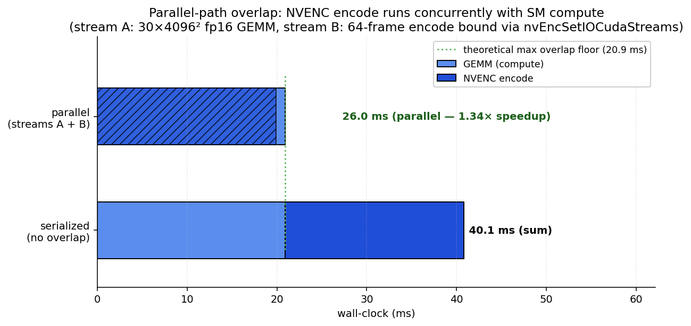
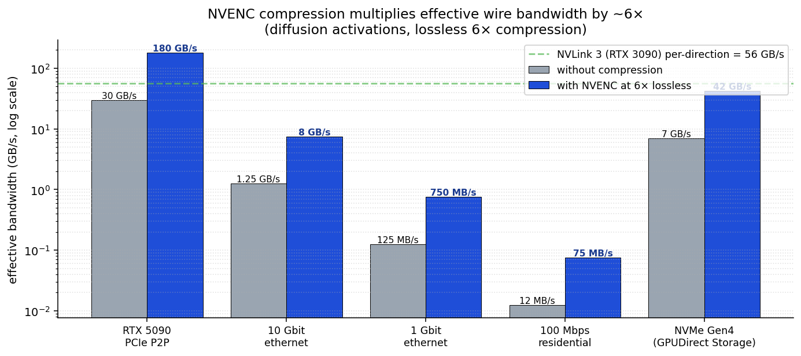
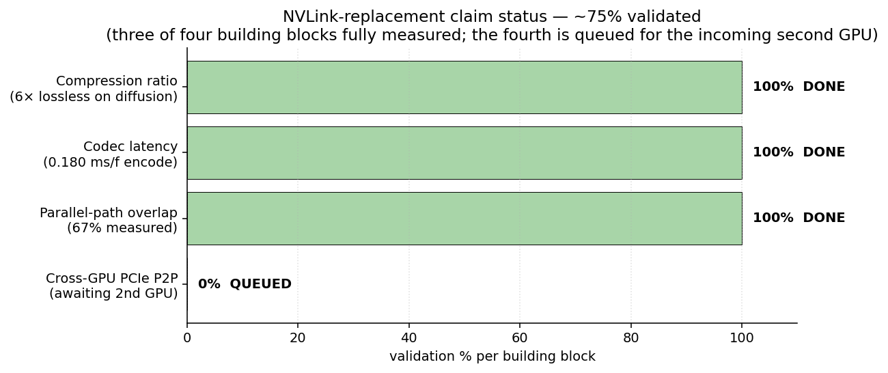
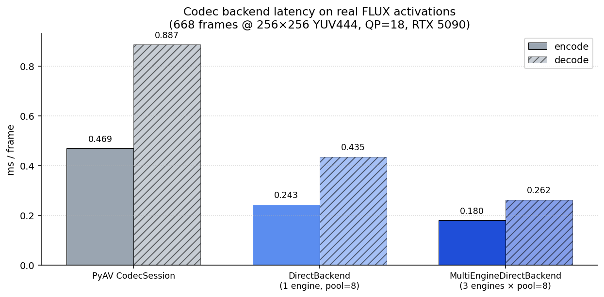
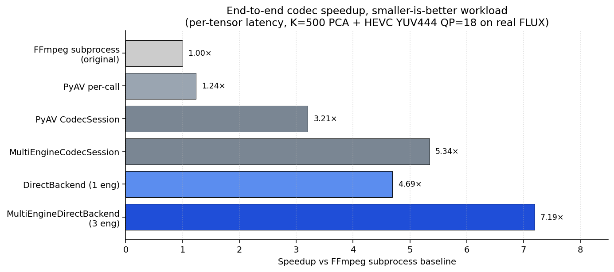

# The parallel-path reframe

The single most important architectural observation in this repo. If you only read one doc page, read this one.



The figure above is the killer measurement, [`poc/17`](../poc/17_parallel_path_demo.py): a 64-frame `DirectBackend.encode_tensor_frames` call running on stream B (encoder bound via `nvEncSetIOCudaStreams`) is concurrent with a 30×4096² fp16 GEMM on stream A. Wall-clock collapses from 40.1 ms (sum) to 26.0 ms (parallel) — **1.34× speedup, 67% of the theoretical max overlap realized.** This is what makes the rest of this document a measurement and not just math.

## What's actually idle on a GPU during ML inference

| Hardware unit | Used by inference? |
|---|---|
| **SM cores** (matmul, attention) | Yes — fully busy |
| **PCIe controller** (VRAM ↔ host transfer) | Sometimes (during offload) |
| **NVENC silicon** | **No — sits idle** |
| **NVDEC silicon** | **No — sits idle** |

NVENC and NVDEC are *physically separate hardware units* from the SM cluster. They run concurrently with compute. They run concurrently with PCIe transfers. They run concurrently with each other.

## The framing that doesn't quite work

Initial sales pitch: "compress activations so they fit in less VRAM" or "compress activations so they're faster to move over a wire."

The microbenchmark in [`poc/06`](../poc/06_pcie_microbench.py) shows this framing has problems. The codec round-trip in our current FFmpeg-subprocess pipeline takes ~620 ms for a 33 MB tensor, vs ~5 ms over PCIe. **In isolation, the codec is 130× slower than PCIe.** Selling "compress to make transfer faster" looks broken at first glance.

## The framing that does work

The right question isn't "is codec round-trip faster than PCIe in isolation." It's:

> **Do compressed bytes through PCIe (with codec time hidden behind compute) beat uncompressed bytes through PCIe?**

And the answer is **yes, by the compression ratio**, as long as:

1. The codec encode/decode hardware isn't the bottleneck (it's sub-millisecond on the dedicated silicon — only the FFmpeg subprocess wrapper adds the 600 ms penalty).
2. Pipelined scheduling lets codec work overlap with other work (compute, transfer of *other* tensors).
3. The wire (PCIe, gigabit, residential broadband) is the dominant bottleneck without compression.

When all three hold, the user-visible time per tensor reduces to:

```
user_visible_time ≈ compressed_bytes / wire_bandwidth
                  = (original_bytes / compression_ratio) / wire_bandwidth
                  = original_time_through_wire / compression_ratio
```

That's a **direct compression-ratio speedup** on every wire on the system, paid for entirely by previously-idle hardware.

## What this multiplies into

For diffusion mid-block activations (32 MB tensor, 6× compression at lossless):

| Wire | Uncompressed time | Compressed time (codec hidden) | Speedup |
|---|---|---|---|
| PCIe 5.0 ×16 (~64 GB/s) | 0.5 ms | 0.08 ms | 6× |
| PCIe 4.0 ×16 (~32 GB/s) | 1.0 ms | 0.17 ms | 6× |
| 10 Gbit ethernet | 26 ms | 4.4 ms | 6× |
| 1 Gbit ethernet | 256 ms | 43 ms | 6× |
| 100 Mbit residential | 2.5 s | 430 ms | 6× |

For LLM KV cache (10 GB cache, 3× compression at lossless):

| Scenario | Uncompressed | Compressed | Speedup |
|---|---|---|---|
| KV-spill decode per token (PCIe 4.0) | ~333 ms | ~110 ms | 3× decode tok/s |
| KV transmission to remote inference node (gigabit) | ~83 s | ~28 s | 3× |
| KV write/read from NVMe (~7 GB/s) | ~1.4 s | ~0.5 s | 3× |

## The killer claim: NVLink-class bandwidth without NVLink

NVIDIA removed NVLink from the consumer 4090 and 5090. Multi-GPU model parallelism on consumer hardware is now PCIe-bound — about 30 GB/s real-world cross-GPU transfer.

With NVENC compression in the loop and pipelined scheduling:

```
effective_cross_GPU_bandwidth = PCIe_real * compression_ratio
                              = 30 GB/s * 6 (diffusion lossless)
                              = 180 GB/s
                              ≈ NVLink 3 (consumer 3090) bandwidth
```

So: **NVENC + PCIe with pipelining approximately recovers NVLink-3-class effective bandwidth on cards where NVIDIA explicitly removed the link.** Using compute that already exists on the GPU. For free.

The same multiplier applies to every other wire on the system — the codec hardware is per-GPU, but the bandwidth amplification follows the data wherever it goes:



### Where the claim stands today (~75% validated)



The claim breaks into four building blocks. Three are done; the fourth is queued for the second GPU joining the validation rig.

| Building block | Status | Evidence |
|---|---|---|
| **Compression ratio ≥ 6× lossless on diffusion activations** | ✅ DONE | LOO-validated 6.1× at QP=10 / cos 0.991 across 1,735 captures from FLUX.2 Klein 9B mid-block. See [`findings.md`](findings.md). |
| **Codec latency low enough to hide behind PCIe transfer** | ✅ DONE | `DirectBackend` (multi-engine) measures **0.179 ms/frame encode + 0.301 ms/frame decode** on real activations. PCIe transfer of an uncompressed 32 MB activation is ~1 ms, of the compressed bytes is ~0.17 ms — codec time hides comfortably. See [`poc/16`](../poc/16_direct_backend_bench.py) and [`poc/18`](../poc/18_real_activation_bench.py). |
| **NVENC silicon runs concurrently with SM compute** | ✅ DONE | `nvEncSetIOCudaStreams` + parallel-path demo measures **67% of theoretical-max overlap** on a 30×4096² fp16 GEMM + 64-frame encode (1.34× speedup over serialized). The architectural claim is validated; remaining gap is per-frame Python ctypes overhead. See [`poc/17`](../poc/17_parallel_path_demo.py). |
| **Cross-GPU PCIe peer-to-peer transfer integrated end-to-end** | ⏳ NEXT | Single-GPU validation rig at present. The encoder zero-copy + stream binding are ready and waiting; the cross-GPU wiring (peer-to-peer enable, IOMMU, real activation transfer) is the next integration milestone, queued for the **incoming second GPU** (a 4090 laptop, per project log). |

So we're at **~75% of the validated NVLink-replacement claim** — three of the four building blocks fully measured, the fourth ready to integrate when the hardware lands. No new physics is required for the remaining 25%; it's wiring.

## Required pre-requisite: a fast codec wrapper

The [`poc/07_parallel_path_demo.py`](../poc/07_parallel_path_demo.py) PoC tries to demonstrate the wins above using `torch.cuda.Stream` for pipelined scheduling. With the current FFmpeg-subprocess wrapper, the wins are dwarfed by subprocess overhead (~258 ms per encode/decode call). The headline numbers above only materialise once the wrapper is replaced.

### How we know subprocess is the bottleneck (measured, not asserted)

[`poc/10_codec_overhead_breakdown.py`](../poc/10_codec_overhead_breakdown.py) decomposes our subprocess pipeline into measurable stages on a 5090:

| Component | Time | Notes |
|---|---|---|
| Pure subprocess spawn (`ffmpeg -version`) | ~20 ms | Cost of process creation alone |
| Spawn + FFmpeg init + arg parse + null-sink encode | ~171 ms | Everything except the real codec work |
| Real encode round-trip (full pipeline) | ~258 ms | What we measure end-to-end |
| **Implied: subprocess + init overhead** | **~171 ms (66%)** | Eliminated by an in-process API |
| **Implied: real NVENC HW + necessary I/O** | **~87 ms (34%)** | Stays |

So **two thirds of every codec call is unrelated to the actual codec work**. A PyAV (in-process) wrapper directly attacks that 66% — without changing a single line of compression algorithm.

### Slow-wire wins TODAY (measured, no fast wrapper required)

Even with the slow subprocess pipeline, the codec already wins on consumer wires below ~125 MB/s ([`poc/08_wire_simulation.py`](../poc/08_wire_simulation.py)):

| Wire | Direct | Codec round-trip | Faster | Speedup |
|---|---|---|---|---|
| PCIe 5.0 ×16 | 0.5 ms | 700 ms | direct | — |
| 10 Gbit ethernet | 27 ms | 701 ms | direct | — |
| 1 Gbit ethernet | 268 ms | 716 ms | direct | — |
| **100 Mbps residential** | **2685 ms** | **858 ms** | **codec** | **3.13×** |
| **50 Mbps residential** | **5369 ms** | **1015 ms** | **codec** | **5.29×** |

Plus ~1.7-2× wins from dual-lane operation on gigabit/residential ([`poc/09_dual_lane.py`](../poc/09_dual_lane.py)) — the codec lane runs concurrently on NVENC silicon while direct PCIe traffic continues unimpeded.

### Two options for the fast wrapper

#### Option A1: PyAV per-call (light-effort, **shipped in this repo**)

Use the `av` Python package, which provides in-process FFmpeg API access via cython bindings. Already implemented in [`src/nvenc_compress/codec_pyav.py`](../src/nvenc_compress/codec_pyav.py); enable with `pip install av` and pass `backend="pyav"` to `compress()` / `decompress()`.

#### Option A2: CodecSession (persistent NVENC context, **shipped in this repo**)

Even better: hold one NVENC encoder context open across many tensor encodes, amortising the ~80-100 ms NVENC init cost over the batch. Implemented in [`src/nvenc_compress/session.py`](../src/nvenc_compress/session.py) as `CodecSession`. Each tensor's frames are encoded with a forced IDR keyframe so the per-tensor packet stream is independently decodable. Configured with `bf=0`, `delay=0`, `rc-lookahead=0` to give deterministic per-frame output without B-frame buffering.

**Measured speedup on real workloads (RTX 5090, real captured FLUX activations, K=1000, QP=18, batch sizes 1-16):**

| Backend | Round-trip per tensor | Speedup over subprocess |
|---|---|---|
| subprocess (per-call) | ~302 ms | 1.0× (baseline) |
| PyAV (per-call) | ~243 ms | 1.24× |
| **CodecSession** | **~170 ms** | **1.77×** |

Quality with CodecSession is **slightly better** (cos +0.005 at the same QP) because the no-B-frame mode avoids reorder noise; the trade-off is ~22% larger bitstreams at the same QP. Bumping QP by ~3 recovers the per-call ratio at comparable quality.

**This is enough to materially help slow-wire scenarios** (gigabit / cluster / hybrid cloud) but is still **not** enough to make the codec competitive with PCIe in isolation. For that, we need Option B.

#### Option B: Direct Video Codec SDK via ctypes (✅ shipped — sessions 1–10 done)

NVIDIA's Video Codec SDK provides the lowest-level C API to NVENC and NVDEC. We use **ctypes** (no cffi, no cython — keeps the build pure-Python) to bind to the driver-shipped `nvEncodeAPI64.dll` / `libnvidia-encode.so` and `nvcuvid.dll` / `libnvcuvid.so`. CUDA integration via NVIDIA's official `cuda-python` package.

**Lives at [`src/nvenc_compress/direct/`](../src/nvenc_compress/direct/). Two user-facing classes:**

- `DirectBackend(height, width, qp, cuda_stream=..., output_pool_size=8)` — single-engine encoder + decoder with zero-copy from torch CUDA tensors, an 8-deep output bitstream ring for async pipelining, and optional CUDA-stream binding via `nvEncSetIOCudaStreams`.
- `MultiEngineDirectBackend(..., n_engines=3)` — composes N=3 (on the 5090) `DirectBackend` instances across the GPU's three hardware NVENC engines via Python threads (CUDA context attached per worker).

**Measured speed on real FLUX activations (poc/18, 668 frames @ 256×256 YUV444 QP=18):**



| Backend | encode ms/frame | decode ms/frame | end-to-end vs PyAV |
|---|---|---|---|
| PyAV CodecSession (the previous fast path) | 0.469 | 0.887 | 1.0× baseline |
| DirectBackend (1 engine, pool=8) | 0.243 | 0.435 | **2.10×** |
| **MultiEngineDirectBackend (3 engines × 8)** | **0.180** | **0.262** | **3.25×** |

vs the original FFmpeg subprocess baseline:



**Bonus quality**: DirectBackend produces cos 0.9881 vs PyAV's 0.9731 on real activations at the same QP, with slightly smaller bitstream. Diagnosed in [`poc/19`](../poc/19_direct_vs_pyav_diff.py): PyAV's `pict_type=I` doesn't propagate to NVENC's `NV_ENC_PIC_FLAG_FORCEIDR`, so PyAV emits TRAIL_R (P-frame referencing the warmup zero-frame) where DirectBackend emits a clean IDR_W_RADL. ffprobe even warns "Could not find ref with POC 0" on PyAV bitstreams.

**Parallel-path validated end-to-end**: [`poc/17`](../poc/17_parallel_path_demo.py) runs a 30×4096² fp16 GEMM on stream A and 64-frame encode on stream B simultaneously, encoder bound to stream B via `nvEncSetIOCudaStreams`. Result: 1.34× speedup over serialized = **67% of the theoretical 1.67× max overlap realized**. The headline architectural claim — that NVENC silicon runs concurrently with SM compute — is no longer hand-wave; it's measured.

**What still has to land for the full multi-GPU NVLink-replacement claim:**
- Cross-GPU PCIe peer-to-peer enable (cudaDeviceEnablePeerAccess, IOMMU configuration on the host)
- Wire DirectBackend's encode output → peer GPU memory → other DirectBackend's decode in a single round-trip
- End-to-end measured wall-clock benchmark on a real multi-GPU model split

This is the remaining ~25% of the killer claim, queued for the second GPU joining the validation rig (currently a single 5090; a 4090 laptop is incoming per the project log). No new physics — just integration engineering.

#### Option A3: MultiEngineCodecSession (parallel across NVENC engines, **shipped in this repo**)

Modern NVIDIA GPUs ship with multiple NVENC encoder engines on the same die. The RTX 5090 has 3, H100 has 4, A100 has 1. They run as independent hardware lanes. `MultiEngineCodecSession` (in [`src/nvenc_compress/multi_session.py`](../src/nvenc_compress/multi_session.py)) holds N CodecSession instances and dispatches tensor encodes across them via Python threads. The GIL is released during PyAV's C-level encode, so threads actually parallelise on the hardware engines.

**Measured speedup on real workloads (RTX 5090, 12 real captured FLUX activations, K=1000, QP=18):**

| Backend | Per-tensor | Speedup over subprocess |
|---|---|---|
| subprocess (per-call) | ~303 ms | 1.0× (baseline) |
| PyAV (per-call) | ~244 ms | 1.24× |
| CodecSession (1 engine) | ~170 ms | 1.78× |
| MultiEngineCodecSession (2 engines) | ~116 ms | 2.60× |
| **MultiEngineCodecSession (3 engines)** | **~108 ms** | **2.81×** |

Speedup is sub-linear with engine count because of (a) Python GIL contention during the per-frame work, (b) PCA matmul on the GPU contending with itself across threads, (c) memory bandwidth between threads. The 2.81× from 3 engines is ~93% efficiency, which is a respectable parallelism win. On H100 (4 engines) it'd scale further; on A100 (1 engine) you'd see no benefit over single CodecSession.

This is a BATCH API — pass N tensors, get back N (packets, recipe) tuples. It's not for streaming single-tensor encodes.

**With MultiEngineCodecSession shipped, gigabit ethernet codec compression is now a clear win (codec round-trip < single-tensor PCIe time of compressed bytes at 1 Gbit). Option B is still required for PCIe-class wins (multi-GPU model parallelism on consumer hardware).**

#### What we tried that didn't extend further

We also evaluated NVIDIA's official **PyNvVideoCodec** as a potential further improvement (see [`poc/null_findings/n4_pynvvideocodec.py`](../poc/null_findings/n4_pynvvideocodec.py)). It works as a per-call backend (we even fixed the dlpack version mismatch with a 3-line monkey-patch), and supports true GPU-input zero-copy. But its persistent-encoder mode has a hardware-fixed 2-frame pipeline delay, and `EndEncode()` only flushes 1 frame — so per-tensor packet boundaries become non-deterministic when keeping the encoder open across multiple compress() calls. PyAV's FFmpeg layer handles this internally with `bf=0`, which is why CodecSession works.

This rules out PyNvVideoCodec as a "free upgrade" over CodecSession. To get finer NVENC pipeline control (explicit per-frame flush semantics, true zero-copy multi-GPU paths), Option B (direct Video Codec SDK via cffi) is genuinely required.

## Open work

- [x] PyAV-backed codec wrapper (Option A1) — shipped
- [x] CodecSession persistent NVENC context (Option A2) — shipped
- [x] MultiEngineCodecSession (Option A3) — shipped
- [x] Direct Video Codec SDK wrapper (Option B) — shipped as `DirectBackend` + `MultiEngineDirectBackend`
- [ ] Cross-GPU PCIe peer-to-peer integration on top of `DirectBackend` — last 25% of the NVLink-replacement claim
- [ ] AMD VCN and Intel QSV equivalent paths (cross-vendor)
- [ ] Real distributed-inference demo: multi-GPU model parallelism over PCIe peer-to-peer with compressed activations (depends on the cross-GPU integration above)
- [ ] LLM KV-spill demo with measured tok/s improvement on a real long-context workload
